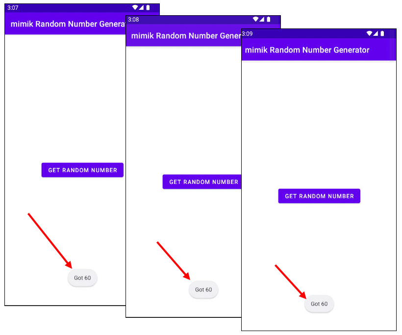
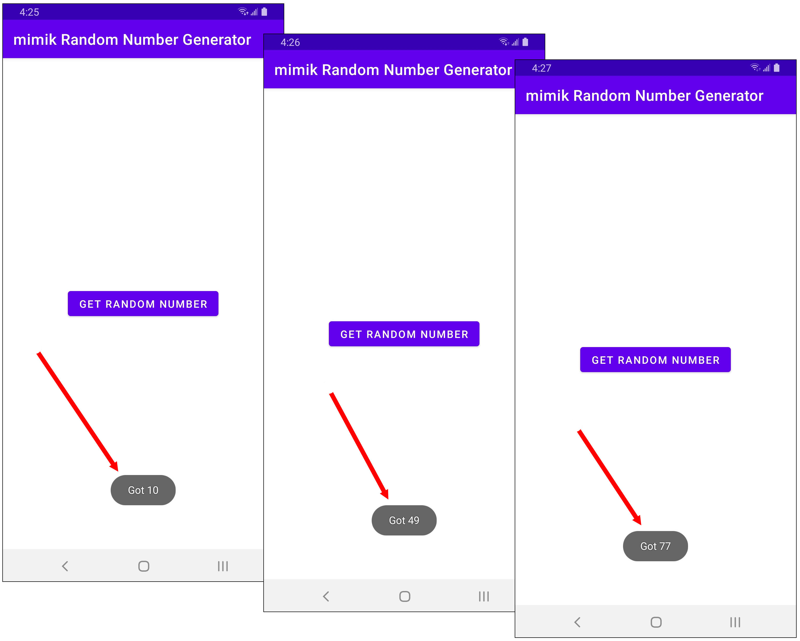

# Random Number Generator for Android Devices
The purpose of this project is to demonstrate how to program an Android application that generates a random number using a edge microservice that runs under the edgeEngine Runtime.

|What are the edgeEngine Runtime and edge microservices|
|----|
|The edgeEngine Runtime and edge microservices are technologies developed by mimik. mimik technology enables any computing device to act as a server, enabling all computing devices to communicate directly at the application layer according to the principles of edge computing.|

To clone the code to your local machine, execute the following command:

`git clone https://github.com/mimikgit/random-number-generator-android.git`

# Using the project with the edge microservice tutorial

This project is intended to be the demonstration code that accompanies the online tutorial *Creating a Simple Android Application that Uses an edge microservice*. You can find the tutorial [here](http://TO_BE_PROVIDED.com).

This project is structured as a scenario that shows you how to fix a bug in the code by using an edge microservice to solve the problem. The bug is that the code is supposed to generate a random number each time a button on the screen of the Android device is pressed. But, it doesn't. The same number keeps appearing. However, this project does have code that provides a fix.

This project is divided into two branches. The `main` banch has the buggy code. The branch, `completed_code` has the code that fixes the bug.

You might want to take a look at the buggy project to in the `main` branch to see how the project is structured.

Then, if you want to see the bug free code in the branch `completed_code` in GitHub on your browser, go [here](https://github.com/mimikgit/random-number-generator-android/tree/completed_code).

If you want see the fixed code locally, checkout the branch `completed_code` using the following command:

`git checkout completed_code`

For a version that can query other devices actively running the same application for numbers, checkout the branch `superdrive_enabled` using the following command:

`git checkout superdrive_enabled`

When running the `superdrive_enabled` version, ensure that any devices on the network actively running mimik Random Number Generator are running the `superdrive_enabled` version.  

# Getting the code up and running

**BE ADVISED:** In order to run this code you need to have an active project registered with mimik.com.

You can create and register a project in the mimik Developer Console website [here](https://developer.mimik.com/console). **There is no charge for creating a mimik project. It's absolutely free!**

You'll configure the application using the various tokens generated from within a mimik Developer Console.

As mentioned above, to get the most benefit from this project, it's best to follow along with the instructions provided in the tutorial [here](http://TO_BE_PROVIDED.com).

